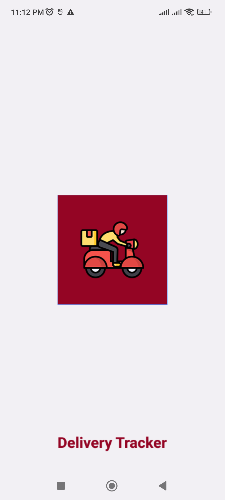
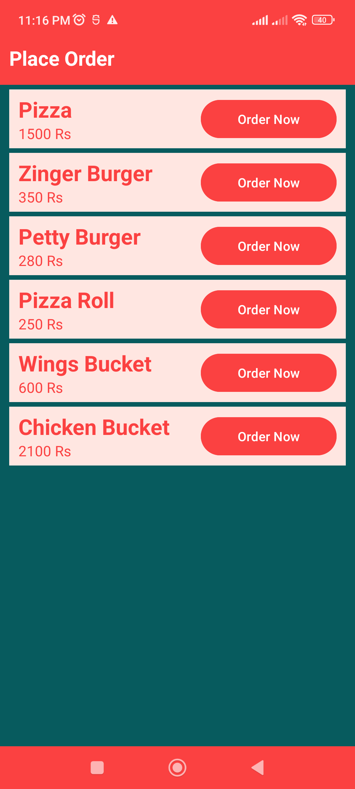
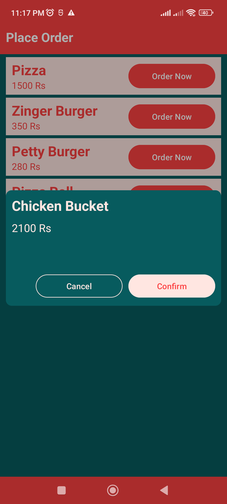
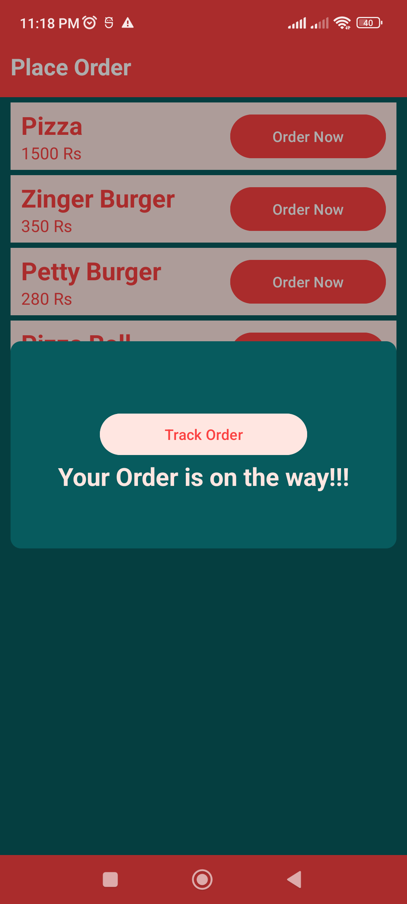
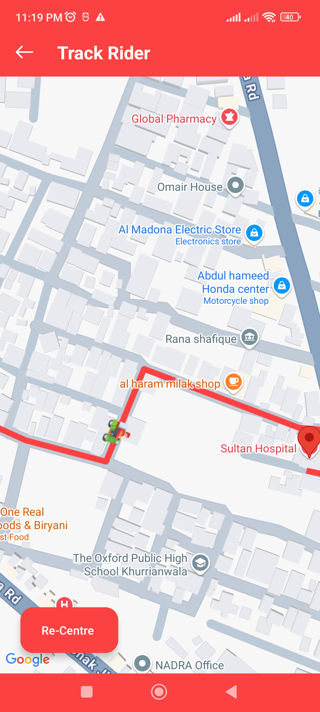
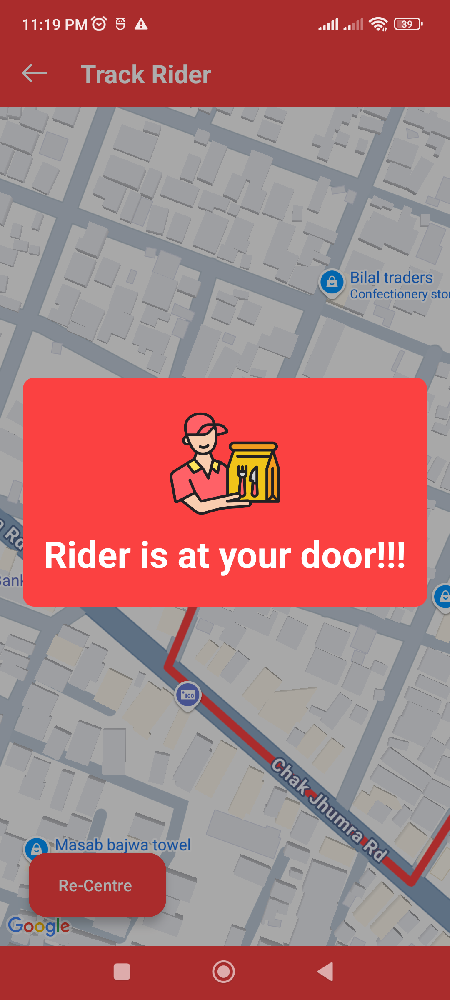

## 🚀 Android App Description

This Android application demonstrates real-time route animation using Google Maps. Built with a modern tech stack including **Kotlin**, **Dagger2**, **MVVM architecture**, **Retrofit**, **Firebase Firestore**, and **Kotlin Coroutines**.

### ✨ Key Features

- Utilizes **Google Directions API** to fetch a list of latitude and longitude points between the origin and destination.
- Draws a **polyline** on the map to represent the route.
- Animates a **bike marker** smoothly along the route using the generated coordinates.
- The bike animation is **simulated programmatically** in the absence of real-time GPS data.

## 📸 Screenshots

  
  
  
  
  
  

